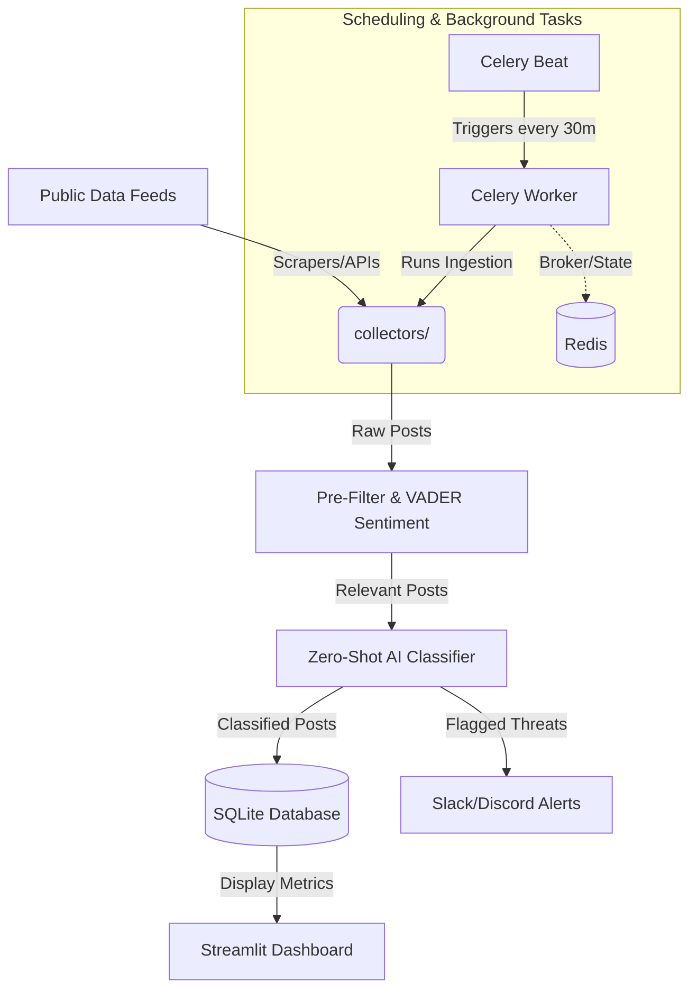

# NTK Party Social Media Threat Monitor

An automated, budget-friendly threat intelligence and public sentiment monitoring pipeline. It scans public data feeds (YouTube, X/Twitter, and Facebook), processes and filters content with light-weight sentiment analysis (VADER), performs zero-shot classification to detect threats or support for the Naam Tamilar Katchi (NTK) party, and alerts stakeholders immediately via Slack or Discord webhooks. All metrics are displayed on a premium Streamlit dashboard.

---

##  Technology Stack

This project is built using a modern, lightweight, and robust Python-based stack designed for efficient web scraping, natural language processing, and real-time dashboarding:

### 1. Frontend & Dashboard
* **[Streamlit](https://streamlit.io/)**: For the premium, interactive web interface. See [dashboard/app.py](file:///d:/Automated_Web_Scraper/automated_web_scraper_v1/dashboard/app.py).
* **Plotly**: Used for dynamic charts, trend visualization, and interactive data analysis.
* **Pyvis & Networkx**: Used for mapping entity relationships and interactive network visualizations of public sentiment/threat actors.
* **Streamlit Autorefresh**: Ensures the dashboard stays up-to-date automatically.

### 2. Task Queue, Broker & Scheduling
* **[Redis](https://redis.io/)**: Serves as the high-performance message broker for Celery and facilitates YouTube API rate-limit/quota tracking.
* **[Celery](https://docs.celeryq.dev/)**: Handles background task distribution (`celery_worker`) and automated schedules (`celery_beat`). See [pipeline/celery_app.py](file:///d:/Automated_Web_Scraper/automated_web_scraper_v1/pipeline/celery_app.py).

### 3. Natural Language Processing (NLP) & Classification
* **HuggingFace Transformers (Zero-Shot Classifier)**: Utilizes CPU-optimized transformer models for zero-shot text classification (labeling posts into categories like `smear_campaign`, `misinformation`, `supportive_mention`). See [pipeline/classify.py](file:///d:/Automated_Web_Scraper/automated_web_scraper_v1/pipeline/classify.py).
* **VADER Sentiment**: Provides lightweight, rule-based sentiment analysis for pre-filtering posts prior to complex classification. See [pipeline/pre_filter.py](file:///d:/Automated_Web_Scraper/automated_web_scraper_v1/pipeline/pre_filter.py).

### 4. Database & Storage
* **SQLite**: A self-contained, lightweight relational database storing all classified alerts and scraper metrics in `threat_intel.db`.
* **SQLAlchemy**: Python SQL toolkit and Object Relational Mapper (ORM) defining the database schema. See [database/database.py](file:///d:/Automated_Web_Scraper/automated_web_scraper_v1/database/database.py).

### 5. Collectors & Scrapers
Custom API clients and feed parsers implemented under the `collectors/` directory:
* **YouTube**: API-based collector with secure simulation fallback. See [collectors/youtube.py](file:///d:/Automated_Web_Scraper/automated_web_scraper_v1/collectors/youtube.py).
* **Twitter / X**: Nitter-based scraper fallback. See [collectors/twitter.py](file:///d:/Automated_Web_Scraper/automated_web_scraper_v1/collectors/twitter.py).
* **Telegram**: Channel feed scraper. See [collectors/telegram.py](file:///d:/Automated_Web_Scraper/automated_web_scraper_v1/collectors/telegram.py).
* **Facebook, Instagram, Mastodon, Reddit, Google News, and Main Media**: Feed parsers and scraping endpoints.

### 6. Infrastructure & Deployment
* **Docker & Docker Compose**: Standardizes environments, manages dependencies, and applies resource constraints (CPU/Memory limits) to ensure system stability.

---

##  Architecture & Data Flow



---

##  Startup & Execution Sequence

You can run this application either locally using a Python virtual environment or containerized using Docker.

### Prerequisites
1. **Python 3.10+** (if running locally)
2. **Docker & Docker Compose** (if running via containers)
3. **Redis** (optional locally, required for Docker setup)

---

### Step 1: Clone & Configure Environment Variables
1. Copy the template `.env.example` to create your active `.env` file:
   ```bash
   cp .env.example .env
   ```
2. Configure key parameters inside `.env`:
   * `TARGET_KEYWORDS`: Comma-separated search terms (e.g., `ntk, nam tamilar katchi, seeman`).
   * `YOUTUBE_API_KEY` (Optional): API key for YouTube Data API. Falls back to simulation mode if omitted.
   * `SLACK_WEBHOOK_URL` / `DISCORD_WEBHOOK_URL` (Optional): URLs for instant notification dispatches.

---

### Option A: Containerized Launch (Recommended)
This approach launches all necessary services automatically using [docker-compose.yml](file:///d:/Automated_Web_Scraper/automated_web_scraper_v1/docker-compose.yml):

1. **Build and start the container services:**
   ```bash
   docker-compose up --build -d
   ```
   This command starts four distinct services in the background:
   * **`redis`**: Message broker on port `6379`.
   * **`dashboard`**: Streamlit application on port `8501`.
   * **`celery_worker`**: Core ingestion task runner.
   * **`celery_beat`**: Scheduler that triggers ingestion every 30 minutes.

2. **Access the Dashboard:**
   Open http://localhost:8501 in your web browser.

3. **Monitor Container Logs:**
   ```bash
   docker-compose logs -f
   ```

4. **Shutdown Services:**
   ```bash
   docker-compose down
   ```

---

### Option B: Local Launch (Python Virtual Environment)
To run directly on your host machine:

1. **Set up the virtual environment & install dependencies:**
   ```bash
   python -m venv venv
   # On Windows:
   .\venv\Scripts\activate
   # On macOS/Linux:
   source venv/bin/activate
   
   pip install -r requirements.txt
   ```

2. **Start Redis Server:**
   Ensure a Redis instance is running locally on port `6379`.

3. **Start the background worker & scheduler (in separate terminal windows):**
   * **Celery Worker:**
     ```bash
     celery -A pipeline.celery_app worker --loglevel=info --concurrency=1
     ```
   * **Celery Beat:**
     ```bash
     celery -A pipeline.celery_app beat --loglevel=info
     ```

4. **Launch the Streamlit Dashboard:**
   ```bash
   streamlit run dashboard/app.py
   ```

---

##  Verifying the Pipeline
1. Open the dashboard (http://localhost:8501).
2. If no data has loaded yet, navigate to the sidebar and click **Run Ingestion Now**.
3. This triggers the ingestion flow manually (via celery task delay or direct execution):
   * Collectors scan active feeds.
   * Relevancy filters discard noise.
   * Zero-shot models classify intent.
   * Detections are stored in `threat_intel.db` and posted to active Discord/Slack hooks.

